# 执行计划

## 详细分析摘要

### 变更影响评估
- **用户面向变更**: 是 — 全新系统，所有功能都是用户面向的
- **结构变更**: 是 — 全新架构，前后端分离，双仓库
- **数据模型变更**: 是 — 全新数据库设计，6 大模型组
- **API 变更**: 是 — 全新 REST API，9 大接口组
- **NFR 影响**: 是 — 性能、安全、文件存储、双环境部署

### 风险评估
- **风险等级**: Medium
- **回滚复杂度**: Low（全新项目，无历史数据迁移）
- **测试复杂度**: Moderate（多模块集成、双部署环境）

---

## 工作流可视化

```mermaid
flowchart TD
    Start(["用户请求"])
    
    subgraph INCEPTION["🔵 INCEPTION 阶段"]
        WD["工作区检测<br/><b>✅ 已完成</b>"]
        RA["需求分析<br/><b>✅ 已完成</b>"]
        US["用户故事<br/><b>✅ 已完成</b>"]
        WP["工作流规划<br/><b>✅ 已完成</b>"]
        AD["应用设计<br/><b>▶ 执行</b>"]
        UG["工作单元生成<br/><b>▶ 执行</b>"]
    end
    
    subgraph CONSTRUCTION["🟢 CONSTRUCTION 阶段"]
        FD["功能设计<br/><b>▶ 执行</b>"]
        NFRA["NFR 需求<br/><b>▶ 执行</b>"]
        NFRD["NFR 设计<br/><b>▶ 执行</b>"]
        ID["基础设施设计<br/><b>▶ 执行</b>"]
        CG["代码生成<br/><b>▶ 执行</b>"]
        BT["构建与测试<br/><b>▶ 执行</b>"]
    end
    
    Start --> WD
    WD --> RA
    RA --> US
    US --> WP
    WP --> AD
    AD --> UG
    UG --> FD
    FD --> NFRA
    NFRA --> NFRD
    NFRD --> ID
    ID --> CG
    CG -.->|下一单元| FD
    CG --> BT
    BT --> End(["完成"])
    
    style WD fill:#4CAF50,stroke:#1B5E20,stroke-width:3px,color:#fff
    style RA fill:#4CAF50,stroke:#1B5E20,stroke-width:3px,color:#fff
    style US fill:#4CAF50,stroke:#1B5E20,stroke-width:3px,color:#fff
    style WP fill:#4CAF50,stroke:#1B5E20,stroke-width:3px,color:#fff
    style AD fill:#FFA726,stroke:#E65100,stroke-width:3px,stroke-dasharray: 5 5,color:#000
    style UG fill:#FFA726,stroke:#E65100,stroke-width:3px,stroke-dasharray: 5 5,color:#000
    style FD fill:#FFA726,stroke:#E65100,stroke-width:3px,stroke-dasharray: 5 5,color:#000
    style NFRA fill:#FFA726,stroke:#E65100,stroke-width:3px,stroke-dasharray: 5 5,color:#000
    style NFRD fill:#FFA726,stroke:#E65100,stroke-width:3px,stroke-dasharray: 5 5,color:#000
    style ID fill:#FFA726,stroke:#E65100,stroke-width:3px,stroke-dasharray: 5 5,color:#000
    style CG fill:#4CAF50,stroke:#1B5E20,stroke-width:3px,color:#fff
    style BT fill:#4CAF50,stroke:#1B5E20,stroke-width:3px,color:#fff
    style INCEPTION fill:#BBDEFB,stroke:#1565C0,stroke-width:3px,color:#000
    style CONSTRUCTION fill:#C8E6C9,stroke:#2E7D32,stroke-width:3px,color:#000
    style Start fill:#CE93D8,stroke:#6A1B9A,stroke-width:3px,color:#000
    style End fill:#CE93D8,stroke:#6A1B9A,stroke-width:3px,color:#000
    linkStyle default stroke:#333,stroke-width:2px
```



### 文本替代
```
INCEPTION 阶段:
  ✅ 工作区检测 (已完成)
  ✅ 需求分析 (已完成)
  ✅ 用户故事 (已完成)
  ✅ 工作流规划 (已完成)
  ▶ 应用设计 (待执行)
  ▶ 工作单元生成 (待执行)

CONSTRUCTION 阶段 (每单元循环):
  ▶ 功能设计 (待执行)
  ▶ NFR 需求 (待执行)
  ▶ NFR 设计 (待执行)
  ▶ 基础设施设计 (待执行)
  ▶ 代码生成 (待执行)
  ▶ 构建与测试 (待执行)
```

---

## 阶段执行计划

### 🔵 INCEPTION 阶段
- [x] 工作区检测 (已完成) — Greenfield 项目
- [x] 逆向工程 (跳过) — Greenfield 项目无需逆向工程
- [x] 需求分析 (已完成) — 标准深度，10+1 问题已解决
- [x] 用户故事 (已完成) — 3 画像，30 故事
- [x] 工作流规划 (进行中)
- [ ] 应用设计 — **执行**
  - **理由**: 全新系统需要定义组件结构、服务层设计、组件间依赖关系。开发文档已提供详细的项目结构，需要在此基础上进一步明确组件方法和业务规则。
- [ ] 工作单元生成 — **执行**
  - **理由**: 系统包含 8 大功能模块 + 双仓库结构，需要分解为可独立开发的工作单元。建议按前端/后端仓库和功能模块交叉分解。

### 🟢 CONSTRUCTION 阶段（每单元循环）
- [ ] 功能设计 — **执行**
  - **理由**: 每个单元有复杂的业务逻辑（报价计算、分类树、分享验证等），需要详细的功能设计。
- [ ] NFR 需求 — **执行**
  - **理由**: 有明确的性能要求（页面 <2s，API <500ms）、安全需求（Token 认证、密码哈希）、文件存储需求。
- [ ] NFR 设计 — **执行**
  - **理由**: NFR 需求已确认，需要设计具体的实现模式（缩略图生成、文件存储策略、缓存策略等）。
- [ ] 基础设施设计 — **执行**
  - **理由**: 双部署环境（Railway+Vercel 测试 / NAS Docker Compose 生产），需要详细的基础设施映射。
- [ ] 代码生成 — **执行**（始终执行）
  - **理由**: 核心实现阶段
- [ ] 构建与测试 — **执行**（始终执行）
  - **理由**: 构建验证和测试指导

### 🟡 OPERATIONS 阶段
- [ ] 运维 — 占位（未来扩展）

---

## 成功标准
- **主要目标**: 交付可运行的家具软装内部管理平台，前后端双仓库
- **关键交付物**:
  - Django 后端 API（所有 9 组接口）
  - React 前端应用（所有页面和组件）
  - 台灯交互登录页
  - Docker Compose 部署配置
  - Vercel + Railway 测试环境配置
- **质量关卡**:
  - 所有 API 接口可用
  - 前端所有路由可访问
  - 登录认证流程完整
  - 文件上传/缩略图生成正常
  - PDF 导出功能可用
  - 双环境部署配置完整
