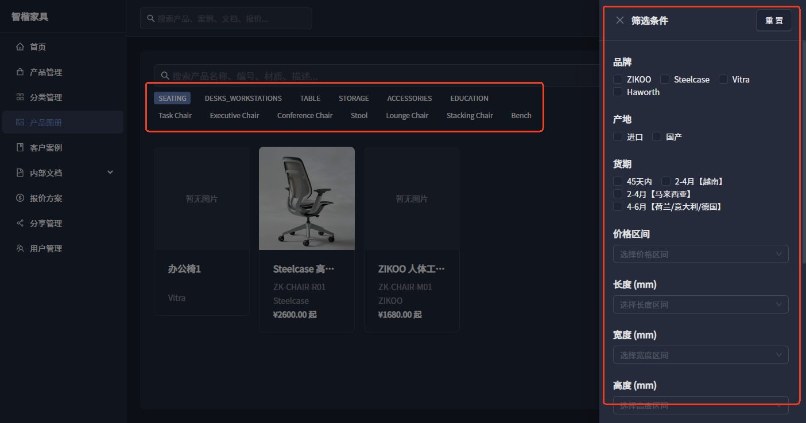
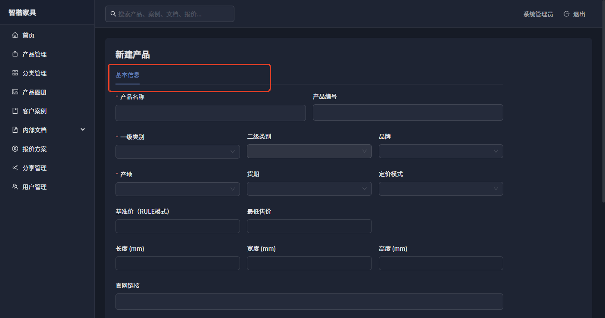
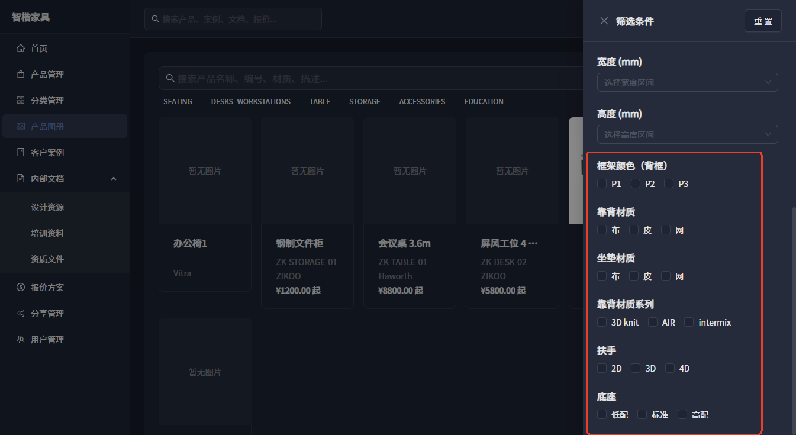
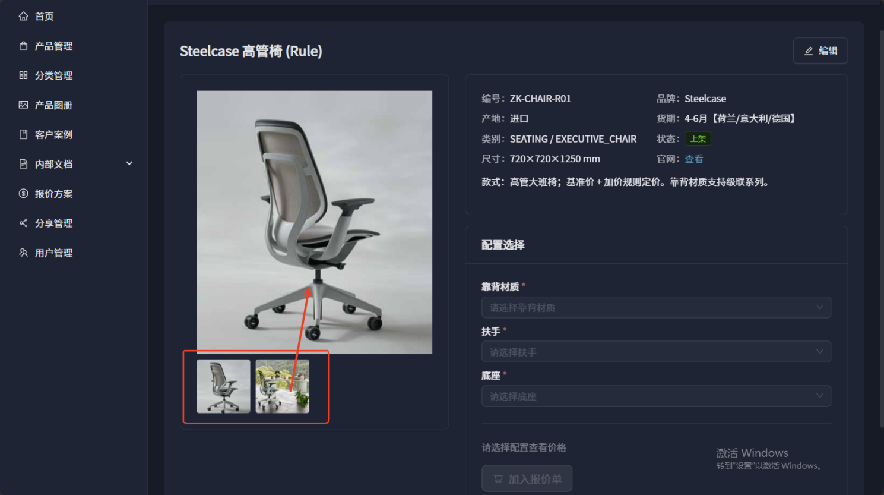
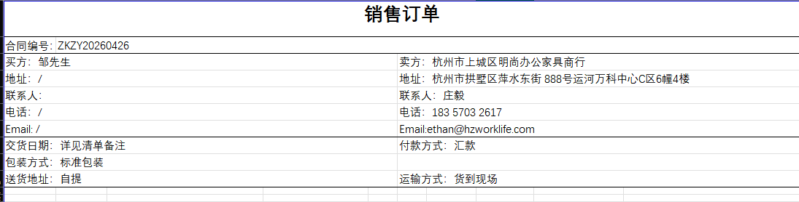
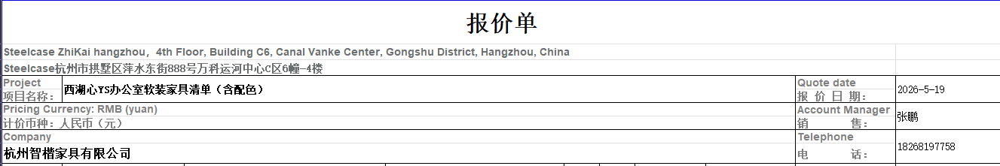
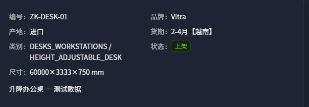
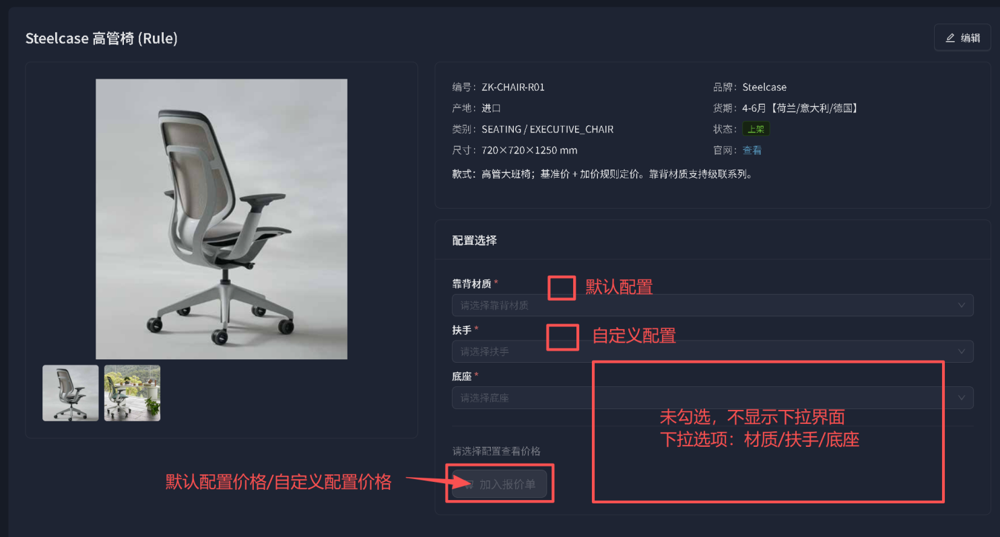

# 软件修改记录 · 家具软装内部管理平台

> 本文件用于记录该项目的所有 Bug 修复、优化与功能改动。
> - **来源**：客户《6.30软件修改.docx》需求清单 + 后续迭代。
> - **维护方式**：新需求/改动追加到对应模块的"需求清单"，完成后在"状态"列更新；每次实际改动在文末《改动记录》按时间登记。
> - **图片**：原始截图存于 `软件修改记录.assets/`。
> - **状态说明**：⬜ 待处理 ｜ 🔧 进行中 ｜ ✅ 已完成 ｜ ⛔ 阻塞（待客户提供材料） ｜ ❓ 待确认（见文末《问题清单》）

最近更新：2026-06-20

---

## 一、客户需求清单（来源：6.30软件修改.docx）

### 1. 产品管理

| 编号 | 类型 | 内容 | 状态 |
|------|------|------|------|
| PM-1 | 优化 | 新增筛选条件：一级、二级分类 + 通用字段筛选（类比产品图册的检索条件） | ✅ |
| PM-2 | 优化 | 一、二级分类英文改为中文（见下方分类对照表） | ✅ |
| PM-3 | 优化 | 点击"新增产品"需同时出现"图片管理 + 配置管理"入口 | ✅ |
| PM-4 | 新增 | 产品下架后增加"重新上架"功能 | ✅ |
| PM-5 | 新增 | 增加批量产品信息上传，支持不同品类、不同模板上传 | 🔧 结构完成/待价格表 |
| PM-6 | 新增 | 已上传配置表格增加"导出"功能，导出当前产品配置数据 | ✅ |

**PM-1 参考截图：**

**PM-2 新版分类中文对照（客户指定 6 大类）：**

- **Seating（坐具类）**：Office Chair（办公椅）、Guest Chair（访客椅）、Conference Chairs（会议椅）、Stools（凳子）、Lounge Seating（休闲坐具）、Visitor Seating（接待椅）、Operator Seating（职员椅）
- **Desks + Workstations（工位办公桌类）**：Desks（办公桌）、Height-Adjustable Desks（升降桌）、Benching（屏风工位）、Private Offices（独立办公室办公桌）
- **Table（桌台类）**：Conference + Collaborative Tables（会议/协作桌）、Occasional Tables（休闲桌）、Outdoor Tables + Shade（户外桌及遮阳设施）
- **Storage（收纳储物类）**：Workstation Storage（工位收纳）、Lockers（储物柜）、Cabinets/Credenzas（文件柜/矮柜）、Bookcases + Shelving（书柜/置物架）、Carts（移动推车）
- **Accessories（配套附件类）**：Modular Walls + Sound Masking（模块化隔断及隔音材料）、Pods（独立 pods 单元）、Freestanding Screens（独立屏风）、Architecture + Space Division（建筑/空间分割件）、Monitor Arms（显示器支架及配件）、Power/Cable Management（电源/线缆管理）、Lighting（照明设备）、Tables（附属桌台配件）
- **Education（教育家具类）**：Classroom Chairs（教室椅）、Education Lounge（教育休闲家具）、Seating（教育类坐具）、Classroom Storage（教室收纳）、Education Desks + Workstations（教育类工位桌）、Accessories（教育类附件）

**PM-3 参考截图：**

### 2. 分类管理

| 编号 | 类型 | 内容 | 状态 |
|------|------|------|------|
| CAT-1 | 删除 | 删除"分类管理"整个版块 | ✅ |

### 3. 产品图册

| 编号 | 类型 | 内容 | 状态 |
|------|------|------|------|
| AL-1 | BUG | 一、二级分类联动有问题：取消一级分类后，二级分类的结果不会消失 | ✅ |
| AL-2 | 优化 | 删除筛选条件里与"椅子类"相关的专有字段 | ✅ |
| AL-3 | 优化 | 3D 模型链接也展示在首页（产品介绍）里 | ✅ |
| AL-4 | 优化 | 多张图片：点击小图，大图显示在展示框中 | ✅ |

**AL-2 参考截图：**

**AL-4 参考截图：**

### 4. 客户案例

| 编号 | 类型 | 内容 | 状态 |
|------|------|------|------|
| CASE-1 | BUG | 只有文字，没有上传图片的地方 | ⬜ |
| CASE-2 | BUG | 新增案例失败 | ⬜ |
| CASE-3 | 新增 | 删除案例功能 | ✅ |

### 5. 内部文档

| 编号 | 类型 | 内容 | 状态 |
|------|------|------|------|
| DOC-1 | BUG | 无文件夹的分类管理功能 | ⬜ |
| DOC-2 | 优化 | 在线预览文件加载速度很慢 | ❓ Q4 |
| DOC-3 | 新增 | 删除文件功能 | ✅ |

### 6. 报价方案

| 编号 | 类型 | 内容 | 状态 |
|------|------|------|------|
| QT-1 | BUG | 报价单状态无法修改 | ✅ |
| QT-2 | BUG | 导出报价单只有英文、数字，中文显示为空（PDF 中文字体缺失） | ✅ |
| QT-3 | 新增 | 报价单支持导出 Excel：报价清单标准格式，格式可选（表头不同、产品信息内容一致，约两种） | ✅ 待最终样表微调 |
| QT-4 | 新增 | 删除报价单功能 | ✅ |
| QT-5 | 优化 | 改变产品配置时跳转到该产品配置页面，并带有原本的配置选择 | ✅ |
| QT-6 | 优化 | 报价单支持在线修改产品配置及价格；体现整体清单折扣，取消单个产品折扣 | ✅ |
| QT-7 | 新增 | 报价单分享权限：仅查看不可修改；区分"他人分享的文件"与"自己创建的文件" | ✅ |
| QT-8 | BUG | 目前已有报价单，所有登录用户都可查看（应按归属/权限隔离） | ✅ |
| QT-9 | 新增 | 增加"初始配置/自定义配置"两个选择；选默认配置则不显示自定义配置选项 | ✅ |

**QT-3 报价单格式参考（客户给出两种示意）：**

**QT-3 标准列字段（客户列出）**：序号、产品名称、产品描述、（默认/自定义配置）、颜色、单价、数量、小计、产地/货期/品牌、图片。

**QT-9 初始/自定义配置参考：**

### 7. 用户权限

| 编号 | 类型 | 内容 | 状态 |
|------|------|------|------|
| AUTH-1 | 新增 | 建立组织架构 | ❓ Q8 |
| AUTH-2 | 新增 | 员工角色之间报价单互不显示，除非主动分享 | ⬜ |
| AUTH-3 | 新增 | 灵活权限设置：超级管理员 / 管理员 / 员工，角色权限的设置能力开放给客户配置 | ❓ Q9 |

---

## 二、改动记录（按时间倒序）

> 下表登记每次实际落地的代码改动。线上环境：前端 https://furniture-zk.zeabur.app ｜ 后端 https://furniture-api-zk.zeabur.app （Zeabur 香港节点）。

### 2026-07-01 · 批次 D-5（QT-3 报价单 Excel 两格式导出）
- 后端 `QuoteExcelService`：明细列统一（序号/产品名称/产品描述/配置/颜色/单价/数量/小计/产地/货期/品牌），两种表头：①「销售订单」中文抬头（合同编号/买卖双方/交货付款）；②「报价单」中英双语抬头（项目名称/报价日期/币种/销售/公司/电话）。新增 `GET /api/quotes/{id}/excel/?format=sales_order|quotation`。
- 前端：报价详情页导出按钮改为下拉：PDF / Excel · 报价单 / Excel · 销售订单。
- 31 测试通过，前端构建通过。最终列/文案以客户样表为准可再调。

### 2026-07-01 · 批次 D-4（QT-5 改配置跳转 + QT-7/8 可见性与分享）
- QT-5：报价明细"改配置"按钮跳转 `/products/{id}?quoteId=&selections=&itemId=`，产品详情页读取 URL 参数自动切换到"自定义配置"模式并预填 selections。
- QT-7/8：新增 `QuoteShare` 模型（迁移 `0004_quoteshare`）；`QuoteViewSet.get_queryset` 非管理员仅返回自己创建 + 被分享的报价单；新增 `mine=true|shared` 分组过滤；分享/取消分享端点 `POST/DELETE /api/quotes/{id}/shares/`（仅创建者/管理员可操作）；`perform_update/destroy` 与 QuoteItem 写操作校验归属，仅创建者/管理员可写，其余只读。
- 前端：报价单列表新增"归属"筛选（我创建的/分享给我的）；详情页新增"分享"按钮 + 用户选择弹窗；他人分享的报价单显示"只读"标签并隐藏编辑按钮。
- 后端 31 测试通过，前端构建通过。

### 2026-07-01 · 批次 D-3（QT-6 折扣改造）
- 后端：Quote 增字段 `discount`（整单折扣 %），`recalculate_total` 按整单折扣结算。迁移 `quotes/0002_quote_discount` + 数据迁移 `0003_bake_item_discounts`（历史 QuoteItem 单项折扣置 0、subtotal 已含折扣不变、总额保持不变）。
- 序列化器新增 discount 字段；QuoteViewSet.perform_update 保存后重算总价。
- 前端：报价单表单加"整单折扣"字段；详情页 Descriptions 增加"整单折扣"、明细列去除"折扣"、编辑仅数量；PDF 模板同步去除单项折扣列并显示整单折扣。产品详情"加入报价单"弹窗去除折扣输入。
- 测试新增 QT-6 回归 2 例，共 31 通过；前端构建通过。

### 2026-07-01 · 批次 D-2（QT-9 默认/自定义配置 + 产品管理筛选修复）
- QT-9：产品详情页新增「默认配置/自定义配置」切换。默认配置=默认预设组合（无则按可见必填维度取首选项），锁定展示且隐藏下拉；自定义配置显示逐维度下拉。价格随选项经算价接口计算。
- 产品管理筛选修复（排查"产品比图册少"）：根因为全局 store 筛选跨页残留 + 下拉非受控。改为进入页面重置筛选、所有筛选下拉受控绑定 store、新增"清除筛选"按钮。
- 前端构建通过。

### 2026-07-01 · 批次 D-1（QT-2 PDF 中文字体 + QT-1 状态修改）
- QT-2：后端 Docker 镜像安装 `fonts-noto-cjk`，PDF 模板 `font-family` 指定 Noto Sans CJK，修复导出中文为空。
- QT-1：报价单编辑表单原本无状态字段导致无法改状态；在报价详情页"状态"处新增状态流转下拉（仅显示合法下一状态，后端 VALID_TRANSITIONS 校验）。
- 前端构建通过。

### 2026-07-01 · 批次 C-2（PM-3 新建产品一页提交）
- 新建产品页在同一页内提交：基本信息 + 图片（暂存待上传）+ 配置维度（暂存待创建）；提交时按序 创建产品→上传图片→创建维度。编辑模式保持原有 Tab（图片管理/配置管理/Excel 导入）。前端构建通过。

### 2026-07-01 · 批次 C-1（结构：尺寸/形状 + 批量导入 + 配置导出）
- 模型：Product 新增 `shape`（可扩展形状）、`diameter_mm`（圆形直径）；`category_l2` 改为自由文本（取值由 CategoryOptionsService 维护，修复新分类 key 的校验问题）；新增 `ProductConfigPreset`（预设款式/默认配置）。迁移 `0002`。
- PM-5 批量导入（长格式）：新增 `BatchProductImportService`（两 Sheet：产品 + 配置参数）+ `POST /api/products/batch-import/`（预览/确认）+ 模板下载 `batch-template`。按 (产品类别, 配置大类) 建维度与选项，"配置款式"→预设，是否默认→默认标记，价格填了则入 ProductPriceRule（最终整机查表定价待客户价格表）。
- PM-6 配置导出：`ConfigExportService` + `GET /api/products/{id}/export-config/`；产品编辑页"导出配置"按钮。
- 前端：产品管理"批量导入"弹窗（下载模板/上传预览/确认导入）；产品表单新增 形状/直径 字段。
- 测试：新增批量导入回归测试 2 例，共 29 通过；前端构建通过。
- 待办：PM-3（新建产品一页提交）留待批次 C-2。

### 2026-06-30 · 批次 B（分类中文化 + 检索）
- PM-2 分类中文化：后端 `CategoryOptionsService` 重写为 6 大类 + 中文标签（key 稳定英文）；前端新增 `constants/categories.ts` 展示映射，产品详情"类别"显示中文；图册标签/产品表单下拉自动中文。`seed_demo` 二级分类 key 更新为新体系，新增 `--flush` 清库重灌。
- PM-1 产品管理筛选：产品列表新增 一级/二级分类、品牌、产地、货期、最低/最高价 筛选；后端 ProductViewSet 支持 `min_price/max_price`。
- AL-1 修复图册一二级联动：取消一级分类时同步剔除失效的二级分类选择。
- AL-2 删除图册"椅子类"动态属性筛选区块（保留通用字段）。
- 27 个测试通过，前端构建通过，本地 `seed_demo --flush` 重灌验证通过。

### 2026-06-20 · 批次 A（阶段一快速项）
- CAT-1 删除"分类管理"菜单与路由。
- PM-4 产品重新上架：后端 `reactivate` 动作 + 列表"上架"按钮（下架产品显示 上架 + 删除）。
- AL-3 产品详情展示 3D 模型链接。
- AL-4 产品详情点击缩略图切换主图（高亮当前图）。
- QT-4 报价单列表删除按钮（管理员）。
- DOC-3 内部文档删除按钮（管理员）。
- CASE-3 客户案例列表编辑/删除按钮（管理员）。
- 27 个测试通过，前端构建通过。

### 2026-06-20 · 产品删除改为两步流程
- 产品列表：上架中显示"下架"按钮（软删除/置为下架），已下架显示"删除"按钮（永久删除）。
- 后端 `perform_destroy` 支持 `?hard=true` 永久删除，默认软删除。
- 新增软/硬删除回归测试 3 例。提交 `44ba5ba`。

### 2026-06-19 · 第二轮 Bug 修复（4 项）
- **产品删除入口**：产品列表新增管理员操作列（编辑 + 删除）。
- **级联约束误报（Steelcase Rule 椅）**：前端按 `parent_dimension` 条件渲染配置维度并连锁清理子选项；后端逻辑无误。
- **报价明细保存失败**：修复 `QuoteItemViewSet.get_queryset`（兼容非嵌套路由）+ 路由增加 PATCH + 前端改用 patch。
- **图片上传入口**：产品编辑页新增"图片管理"Tab（上传/删除/设为封面）。
- 新增报价明细更新回归测试 3 例。提交 `8b5dfdd`。

### 2026-06-19 · 上线 Zeabur（香港节点）+ 测试数据
- 推送 GitHub 仓库 `zizuiliaoya-droid/furniture-platform`；Zeabur 部署 PostgreSQL + 后端 + 前端。
- 幂等种子数据命令 `seed_demo`（参考真实椅子配置）。
- 部署适配：nginx 反代模板、Dockerfile、CSRF/代理头、`?hard` 等。
- 线上验收：登录 / 图册 / 案例 / 品牌 / 算价 / 报价明细 PATCH 全部通过。

### 2026-06-19 · 核心链路强化 + 单元测试
- 价格计算级联校验 + 选项归属校验；图册动态属性筛选前后端打通；Excel 导入确认机制；PDF 媒体路径；文档富文本闭环。
- 建立 pytest 测试基线（共 24 例通过）。

---

## 三、问题清单（待客户答复）

> 以下为需求里需要进一步明确的点。请逐条答复，我据此排期实现。
> 每条均标注**来源**：对应需求编号 + 《6.30软件修改.docx》原文 +（如有）截图。

**Q1（分类中文化）**
- **来源**：需求 PM-2 ｜ 模块「产品管理」｜ docx 原文："将一二级分类英文改成中文"（并在其后给出 Seating/Desks+Workstations/Table/Storage/Accessories/Education 6 大类的中英对照）
- **问题**：新版 6 大类是要**完全替换**现有分类体系，还是与现有"8 大办公空间"分类并存？现有产品的旧分类如何迁移映射？前端只是显示中文，还是后台存储值也改？

**Q2（新增产品入口）**
- **来源**：需求 PM-3 ｜ 模块「产品管理」｜ docx 原文："点击'新增产品'需要同时出现'图片管理+配置管理'" ｜ 截图 image2.png
- **问题**：新建产品时图片/配置需挂在产品上，但产品尚未保存（无 ID）。是否接受：先填基本信息保存生成产品 → 自动进入编辑态并展开"图片管理/配置管理"两个 Tab？还是要求一个页面内一次性提交（含图片与配置）？

**Q3（删除椅子类字段）**
- **来源**：需求 AL-2 ｜ 模块「产品图册」｜ docx 原文："删除筛选条件里相关椅子类的字段" ｜ 截图 image3.png
- **问题**：图册筛选里要删除的"椅子类专有字段"具体指哪些？（例如：框架颜色、坐垫材质、扶手、靠背系列等动态属性）请圈定要保留与要删除的字段。

**Q4（预览慢）**
- **来源**：需求 DOC-2 ｜ 模块「内部文档」｜ docx 原文："在线预览文件加载速度很慢"
- **问题**：预览慢主要发生在哪类文件（大图片 / PDF / Office 文档）？可接受方案是否包括：上传时生成预览图/缩略、大文件改为下载、或接入文档转换服务？

**Q5（在线改配置 + 折扣规则）**
- **来源**：需求 QT-6 ｜ 模块「报价方案」｜ docx 原文："考虑报价单支持在线修改产品配置及价格，体现整体清单折扣，单个产品折扣取消"
- **问题**：确认"取消单个产品折扣、只保留整体清单折扣"——这会改变现有报价数据结构（QuoteItem 现有 `discount` 字段）。历史报价单里已有的单项折扣如何处理（保留只读/清零/迁移到整单）？

**Q6（分享与可见性）**
- **来源**：需求 QT-7 + QT-8（关联 AUTH-2）｜ 模块「报价方案」/「用户权限」｜ docx 原文："新增报价单分享权限，仅查看不可修改内容，区分他人分享文件与自己创建文件" + "BUG目前已有报价单，登录用户都可查看" + "员工角色之间，报价单互不显示，除非分享报价单"
- **问题**：报价单可见性规则请确认：默认仅创建者本人可见；管理员/超管是否可见全部？"分享"是按人分享还是生成只读链接？这与 AUTH-2 是同一套规则吗？

**Q7（初始/自定义配置）**
- **来源**：需求 QT-9 ｜ 模块「报价方案」｜ docx 原文："增加初始配置、自定义配置两个选择，如果选择默认配置，不显示自定义配置选择" ｜ 截图 image9.png
- **问题**：'初始配置'是指产品预设的一套默认选项（一键带入、不可改），'自定义配置'才进入逐维度选择，对吗？默认配置的价格是取该组合的映射价/基准价吗？

**Q8（组织架构）**
- **来源**：需求 AUTH-1 ｜ 模块「用户权限」｜ docx 原文："建立组织架构"
- **问题**：组织架构的层级是怎样的（公司 → 部门 → 员工？是否多级部门）？报价单、产品的归属和可见性是否要按部门隔离？是否需要"部门负责人"这种中间角色？

**Q9（权限粒度）**
- **来源**：需求 AUTH-3 ｜ 模块「用户权限」｜ docx 原文："设置灵活权限设置，超级管理员，管理员，员工。角色权限设置的权限开放给我们"
- **问题**："权限设置开放给客户配置"——希望细到什么粒度？按"模块（产品/图册/案例/文档/报价/权限）×操作（查/增/改/删/导出/分享）"的矩阵勾选是否满足？三种内置角色（超管/管理员/员工）的默认权限是否由客户首次配置后锁定？

---

> 备注：标记 ⛔ 的两项（PM-5 批量上传模板、QT-3 报价单 Excel 格式）需客户先提供模板/样表文件后再开发。

---

## 四、需求决策与设计（2026-06-20 客户答复，已批准执行）

### 4.1 Q1~Q9 决策
- **Q1 分类中文化**：6 大类（Seating/Desks+Workstations/Table/Storage/Accessories/Education）为**产品维度**，与客户案例的"8 大办公空间"**并行不冲突**。分类旧数据**直接清库重灌**（不做映射迁移）。
- **Q2 新增产品**：一个页面一次性提交（含基本信息 + 图片 + 配置），后端事务化组合创建。
- **Q3 图册删字段**：删除"椅子类"动态属性筛选（框架颜色/坐垫材质/扶手/靠背系列/底座等）。
- **Q4 预览慢**：本期不优化，后期再做性能优化。
- **Q5 折扣**：取消单项折扣，仅保留整单折扣；历史报价单将单项折扣"烘焙进小计"后迁移到整单（总额不变）。
- **Q6 可见性/分享**：默认仅创建者可见；管理员/超管可见全部；分享按人（只读）；与 AUTH-2 同一套规则。
- **Q7 默认/自定义配置**：默认配置=产品预设一套选项（一键带入、不可改），价格取该组合的基准价/组合价；自定义配置才逐维度选择；默认配置通过配置 Excel 增加"是否默认配置"列确定。
- **Q8 组织架构**：结构未定（后期再改）。先预设角色：超级管理员/管理员/部门主管/员工；产品归属与可见性按部门隔离；需要"部门主管"角色。
- **Q9 权限矩阵**：按"模块（产品/图册/案例/文档/报价/权限）× 操作（查/增/改/删/导出/分享）"矩阵勾选，支持对角色权限 CRUD，权限可由管理员/超管后期修改。

### 4.2 批量上传（长格式）+ 尺寸/形状模型（Q-A~Q-E）
基于真实文件《产品配置参数表_提取结果.xlsx》（竖排长表：产品类别 | 配置大类 | 部件/材质 | 规格/代码 | 价格）。

- **Q-A/Q-C 定价**：**查表得价，一个最细配置一个价格**（价格写在该配置行的"价格"列）→ 采用 **MATRIX 全组合查价**（复用 `ProductPriceMatrix`）。
- **Q-B 价格区间**：P1/P2/P3 为按桌板材质档位决定的价格档，参与最终查价组合。
- **Q-D 背柜/副柜**：为**主产品绑定的可选配置维度**（不拆独立产品），导入时以前缀键归入该产品（如 `背柜_规格`）。
- **Q-E 形状**：除方形/圆形外还有其他，**以 Excel 数据为准**→ `shape` 字段做成**可扩展文本/字典**，不写死枚举；尺寸交由"规格"配置维度的文本选项承载。

**批量上传模板设计（两 Sheet）**
- Sheet「产品」：`产品类别(名称) | 编号 | 一级分类 | 二级分类 | 品牌 | 产地 | 货期 | 形状 | 定价模式 | 描述`
- Sheet「配置参数」：`产品类别 | 配置大类 | 部件/材质 | 规格/代码 | 价格 | 是否默认配置`

**导入器规则**
- 「产品」每行 → 幂等创建/更新 Product（按编号优先、否则按名称）。
- 「配置参数」按 (产品类别, 配置大类) 分组 → 每个配置大类 = 一个 `ProductConfigDimension`；行 = 选项（`规格/代码` 作 key，`部件/材质 + 文本` 作 label）。
- "产品规格/尺寸"配置大类 → 文本选项承载尺寸（兼容方形 W*D*H、圆形直径、升降范围、台面子尺寸）。
- `是否默认配置=TRUE` → 标记默认配置（对接 QT-9）。
- **价格列可空**：空则只建维度与选项，价格后补；填了价的最细配置行 → 写入 `ProductPriceMatrix`。

**模型调整**
- `Product` 增加：`shape`（可扩展，默认空/不适用）、`diameter_mm`（圆形用，可选）；`length_mm/width_mm/height_mm` 改为可选。
- 新增 `ProductConfigPreset(product, code, label, selections JSON, is_default)`（预设款式 / 默认配置）。
- 图册区间筛选：先按 `shape` 区分，方形按长宽高、圆形按直径；规格维度型产品按"起价"展示，不参与数值区间。

### 4.3 执行批次（在原四阶段基础上细化）
1. **批次 A（阶段一·快速项）**：CAT-1 删分类管理、PM-4 重新上架、AL-3 3D链接、AL-4 点击切图、QT-4 删报价单、DOC-3 删文件、CASE-3 删案例。
2. **批次 B（阶段二·分类与检索）**：PM-2 分类中文化（清库重灌）、PM-1 产品管理筛选、AL-1 联动 BUG、AL-2 删动态字段。
3. **批次 C（结构）**：尺寸/形状模型 + ProductConfigPreset + 长格式批量导入（建维度，价格留空）；PM-3 一页提交；PM-6 配置导出。
4. **批次 D（报价核心）**：QT-2 PDF中文、QT-1 状态、QT-9 默认/自定义配置、QT-6 折扣改造、QT-5 改配置跳转、QT-3 Excel两格式、QT-7/8 可见性与分享。
5. **批次 E（权限）**：AUTH-3 权限矩阵、AUTH-1/2 角色与部门隔离（组织架构树待定延后）。

> CASE-1/CASE-2/DOC-1/QT-1 等 BUG 在对应批次中先排查根因再修。批量导入的算价依赖客户最终价格表，结构先行、价格后补。
